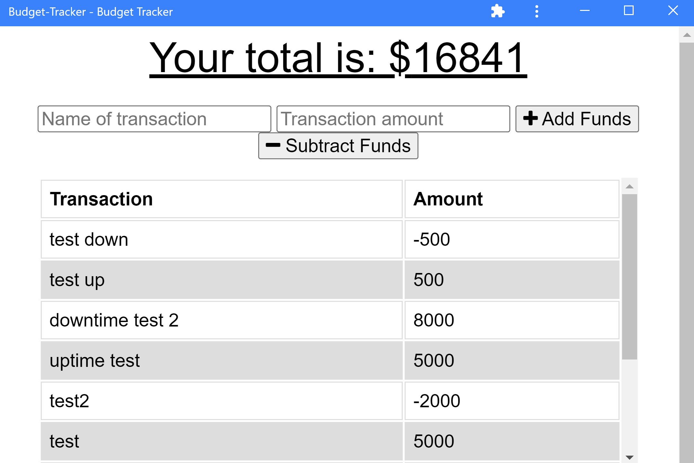
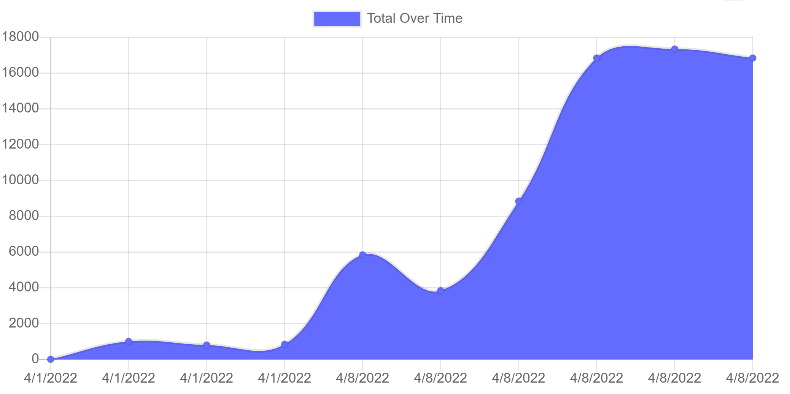

  # Budget Tracker
  [](https://opensource.org/licenses/MIT)

  ## Table of Contents:

  ---
  * [Description](#description)
  * [Installation](#installation)  
  * [Usage](#usage)  
  * [Credits](#credits)    
  * [Tests](#tests)  
  * [Questions](#questions)  

  ## Description

  ---
  This project is a budget tracket to keep track of deposits and paymentst, the tracker will create a graph of spending and account status as well as showing the user's current balance

  ## Installation:

  ---
  To install all necessary dependencies for this program,
  open the console and run the following command:  
  ```npm i```

  ## Usage

  ---
  This project is intended to be used at a PWA (Progressive Web Application) for users to track their spending while offline and have their online version updated once the user regains an internet connection. The app is downloaded from chrome or any browser by clicking the three dots drop down menu, and is used by running the app and inputting a name for a transaction with the transaction ammount and whether it is a deposit or withdrawal.

  

  

  Link to Deployed Application:  
  https://jacobgit3.github.io/Budget-Tracker-PWA/

  ## Credits

  ---
  
    Collaborators:
    Name: Ward Vanlaar
    Github: https://github.com/WardVanlaar
    

  ### Third Party Assets:

  - Express
  - Mongodb
  - Mongoose
  - Morgan
  - Compression
  - Webpack Dev Server
  - Webpack PWA Manifest

  ## Tests

  ---
  To test this application run this command in the console:  
  ```npm start```

  ## Questions

  ---
  For any questions feel free to reach out through the following contacts:  

  Email: jacob.tobin.liberty@gmail.com  
  Github: https://github.com/JacobGit3  
  
